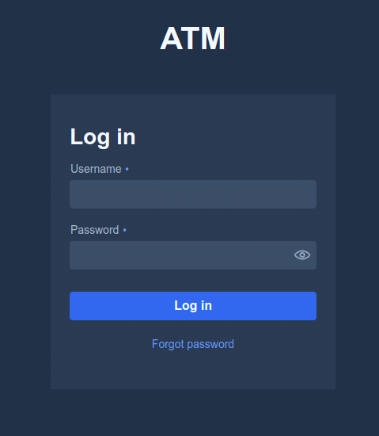
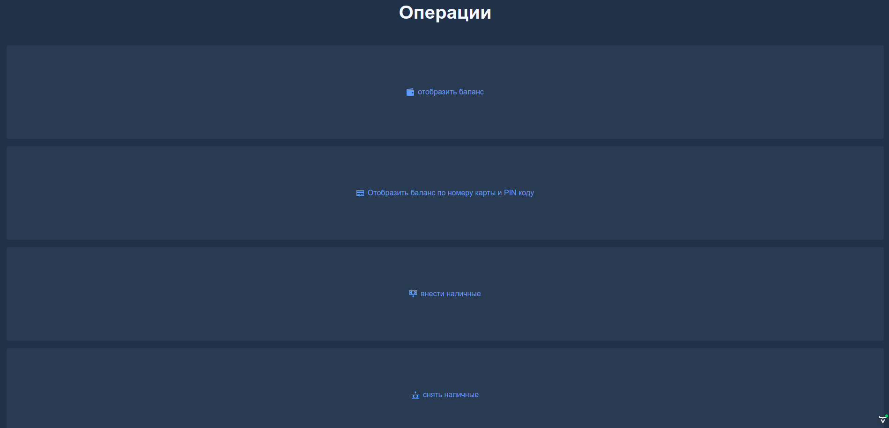
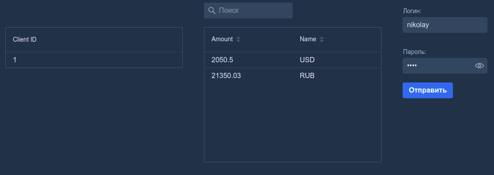
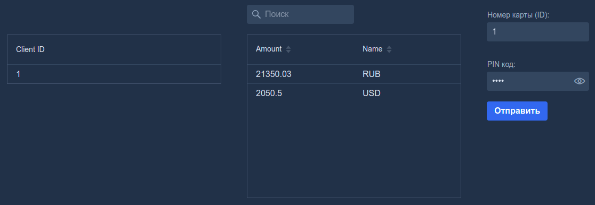
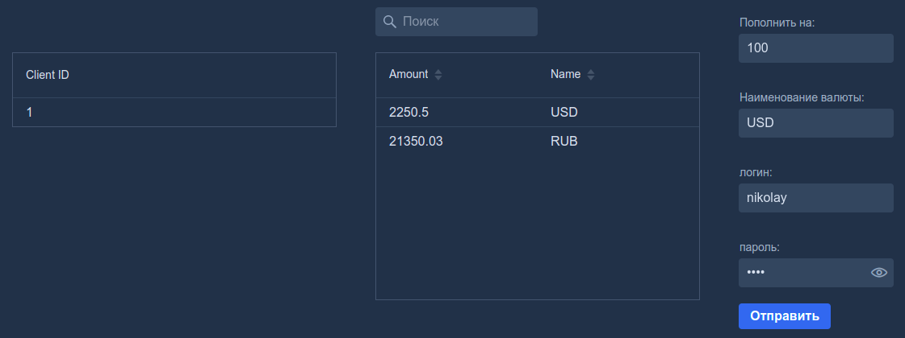
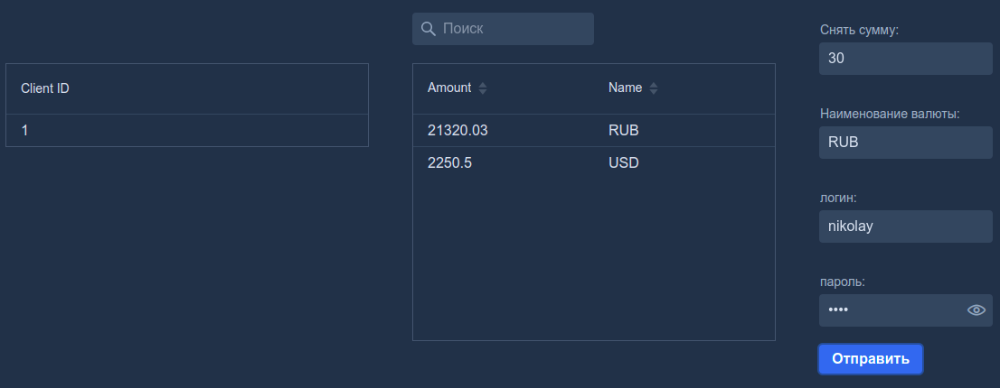

<h1 style="text-align: center;">ATM-client-server</h1>

# _Задачи_

> В проекте реализован пример построения микросервисной архитектуры из двух компонент,
_cервера_ и _клиента_. Проект разбит на 3 модуля _client_, _server_ и _common_.

> Построить модель получения клиентом баланса по карте на банкомате. Классы доменной модели ничего не должны знать о техническом окружении. Подробности технического окружения должны быть скрыты за слоями абстракции. В качестве системы сборки должен использоваться Maven. В финальной версии приложение должно представлять из себя 2 Spring Boot приложения. Одно будет выполнять роль клиента\банкомата, а другое роль сервера. Приложение с ролью сервер должно хранить свои данные в базе данных H2. Для взаимодействия приложения должны использовать REST. Модули должны быть покрыты JUnit тестами. Приложение с ролью сервер должно требовать аутентификации по логину и паролю с использованием Spring Security В качестве задания на 5+ приложения должны уметь переключаться на взаимодействие через Apache Kafka.

# _Используемые технологии_

| Технология                 | описание                                                                                                                                                                                                                      |
|----------------------------|-------------------------------------------------------------------------------------------------------------------------------------------------------------------------------------------------------------------------------|
| *Spring framework boot*    | `Основа микросервисов, позволяет упростить создание автономных приложений.`                                                                                                                                                   |
| *Spring boot starters*     | `Механизмы, позволяющие начать быструю разработку, подключив зависимость.`                                                                                                                                                    |         
| starter-web                | `Стартер для создания веб-приложений, в том числе RESTful, с использованием Spring MVC. Использует Tomcat в качестве встроенного контейнера по умолчанию.`                                                                    |         
| starter-security           | `Стартер объединяет зависимости, связанные с Spring Security. Необходим для аутентификации и авторизации пользователей.`                                                                                                      |         
| starter-data-jpa           | `Стартер для использования Spring Data JPA с Hibernate, который позволяет хранить и извлекать данные в реляционной базе данных.`                                                                                              |         
| starter-test               | `Стартер для тестирования приложений Spring Boot с библиотеками, включая JUnit Jupiter, Hamcrest и Mockito.`                                                                                                                  |         
| *Spring-boot-devtools*     | `Модуль, который включает поддержку быстрого перезапуска приложений.`                                                                                                                                                         |         
| *Spring-boot-maven-plugin* | `Модуль позволяет упаковывать приложение в исполняемые файлы jar или war-архивы, запускать приложения Spring Boot, генерировать информацию о сборке и запускать приложение Spring Boot перед запуском интеграционных тестов.` |
| *Junit*                    | `Библиотека для модульного тестирования.`                                                                                                                                                                                     |         
| *Mockito*                  | `Фремворк, позволяющий сделать заглушку для тестирования логики.`                                                                                                                                                             |         
| *Lombok*                   | `Библиотека, которая позволяет сократить шаблонный код.`                                                                                                                                                                      |         
| *H2 database*              | `Легковесная реляционная СУБД.`                                                                                                                                                                                               |         
| *Java jwt*                 | `Библиотека для создания и проверки токенов JWT.`                                                                                                                                                                             |         
| *Vaadin*                   | `Фреймворк для создания RIA-веб-приложений.`                                                                                                                                                                                  |         

# _UI & User experience_
>Страница аутентификации пользователя, аутентификация возможна только если пользователь сохранен в БД. Таким образом,
отправляется запрос на сторону сервера, и если пользователь найден, то выдается токен JWT, который сохраняется в
пользовательский контекст (custom Java bean).

>Доступные операции для аутентифицированного клиента, некоторые end points не представлены на web страницах Vaadin.
(продемонстрированы только основные).

>Клиент может узнать свой баланс в удобочитаемом формате. Доступ дополнительно требует авторизации.
На стороне сервера проверяется JWT токен и введенные данные.

>Клиент также может узнать свой баланс, используя номер ID (карты) и pin код. Авторизация происходит аналогично,
как описано выше для другой конечной точки.

>Клиент может пополнить выбранный счет на определенную сумму. Также требуется авторизация.

>Клиент может снять с доступных счетов определенную сумму. Требуется авторизация.

>В случае неверных данных при авторизации или аутентификации - все страницы оповестят красным маркером пользователя. 
(Кнопки подсвечиваются красным цветом, форма аутентификации подсвечивает поля также красным цветом). 